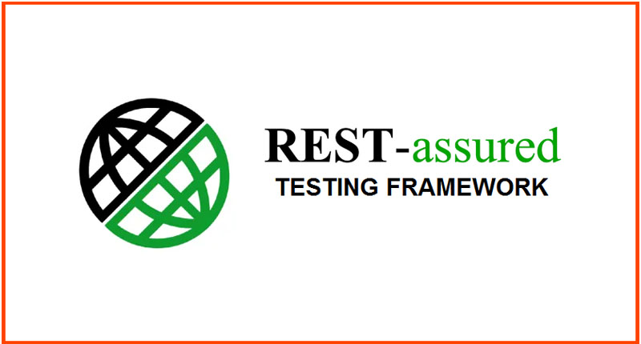
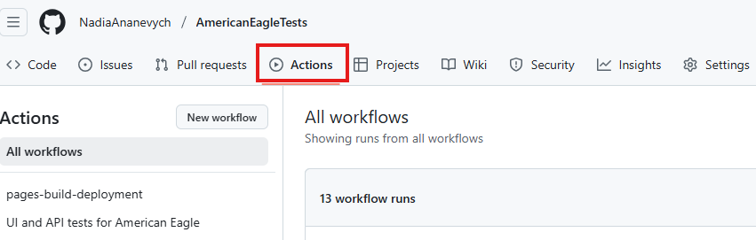
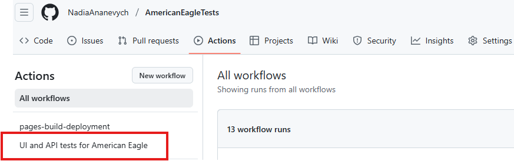
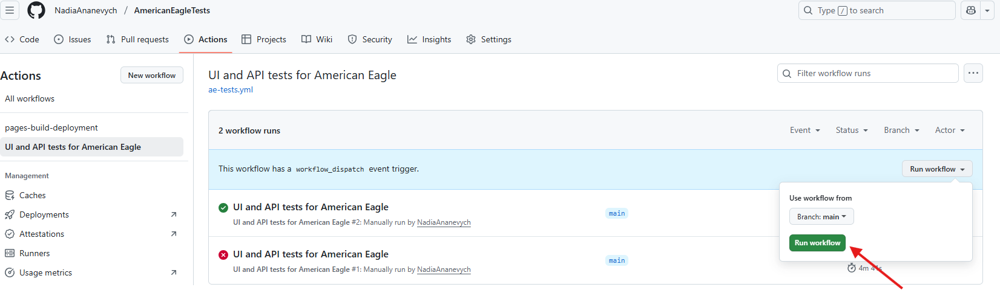
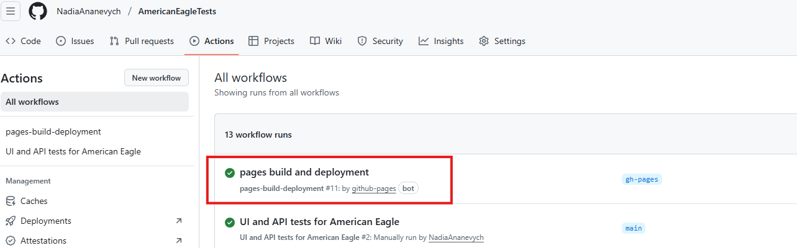
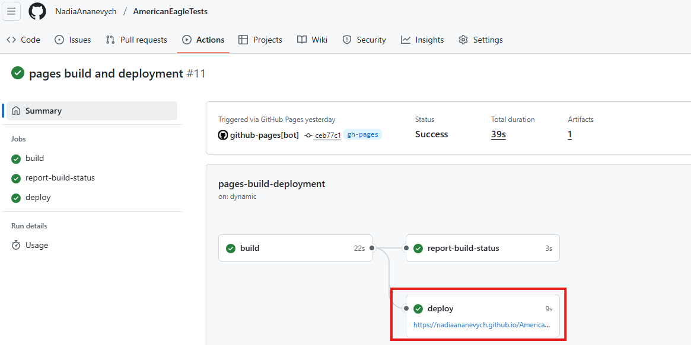
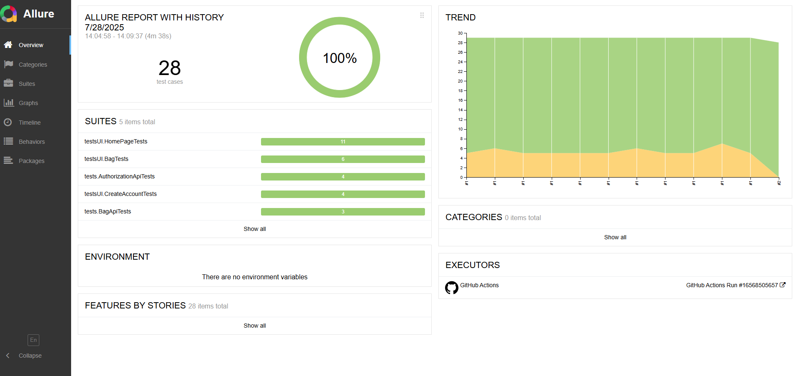
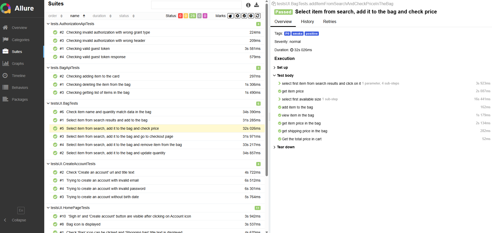

# Automation project for American Eagle website

[](https://www.oracle.com/java/)
[](https://gradle.org/)
[](https://www.selenium.dev/)
[](https://junit.org/junit5/)
[](https://docs.qameta.io/allure/)

This is a graduation project completed as part of the Java automation testing course by [Gennady Chursov](https://github.com/topsycreed).
The primary goal is to automate testing for [**American Eagle**](https://www.ae.com/us/en) — a prominent American brand specializing in lifestyle, clothing, and accessories

Covered areas:

✅ Development of API tests for RESTful endpoints
✅ Automation of UI tests with Selenium WebDriver
✅ Setup of CI/CD pipelines via GitHub Actions, including Allure report generation for detailed test insights

## 📚 Table of Contents

- [🛠️ Technology Stack](#-technology-stack)
- [🚀 Running Tests](#-running-tests)
- [⚙️ Running in GitHub Actions](#-running-in-github-actions)
- [📊 Allure Report in GitHub Actions](#-allure-report-in-github-actions)


## 🛠️ Technology Stack
<p align="center"> 
<a href="https://www.java.com" target="_blank" rel="noreferrer"></a>
<a href="https://gradle.org" target="_blank" rel="noreferrer"></a>
<a href="https://www.selenium.dev" target="_blank" rel="noreferrer"></a>
<a href="https://rest-assured.io/" target="_blank" rel="noreferrer"></a>
<a href="https://junit.org/junit5/" target="_blank" rel="noreferrer"></a>
<a href="https://github.com/features/actions" target="_blank" rel="noreferrer"></a>
<a href="https://github.com/allure-framework/allure2?tab=readme-ov-file" target="_blank">  </a>
</p>

- Java 17 as the programming language
- Gradle for building and managing dependencies
- Selenium WebDriver with Chrome browser for UI automation
- REST Assured for API testing
- JUnit 5 testing framework
- GitHub Actions for CI/CD and project deployment
- Allure for generating detailed test reports


## Running Tests Locally

⚠️ Important: Anti-bot measures on the tested website
Because this project interacts with a live website, it is subject to anti-bot defenses (such as Akamai) that may block automated test requests. As a consequence, some tests may fail regularly even if they are implemented correctly. These tests are specially marked with the @Tag("defect") annotation.
Another common reason for test failures is frequently changing locators on the website, as well as new modal windows or advertisements appearing during test execution.


Open the Gradle tool window in IntelliJ

Run one of the following commands:

💥 Execute all tests:

  ```bash
      gradle clean test -Denv=default
   ```

✅ Execute only stable tests (skipping tests marked with @Tag("defect")):

 ```bash
      gradle clean testWithoutDefects -Denv=default
   ```

---


🔹 Running Tests with GitHub Actions
To execute 💥 automated tests using GitHub Actions:

1.Navigate to the 'Actions' tab in the repository.
<p align="center">  </p>

2.Locate and click on the workflow titled 'UI and API tests for American Eagle'.
<p align="center">  </p>

3.Hit the 'Run workflow' button (top right corner) and confirm execution.
<p align="center">  </p>

4.Monitor the job status until the execution is completed. Results will appear within the workflow summary.


📊 View Allure Report via GitHub Actions
Once the CI workflow has finished running, follow these steps to view the Allure test report:

1.Open the 'Actions' tab in your repository.
<p align="center">  </p>

2.Find the latest workflow run and click on the 'pages-build-deployment' job.
<p align="center">  </p>

3.Once deployment is done, click the 'Deploy link' that appears in the logs.
<p align="center">  </p>

4.The Allure Report will open in a new browser tab. There, you can review detailed results.

<p align="center">  </p> 
<p align="center">  </p> 
